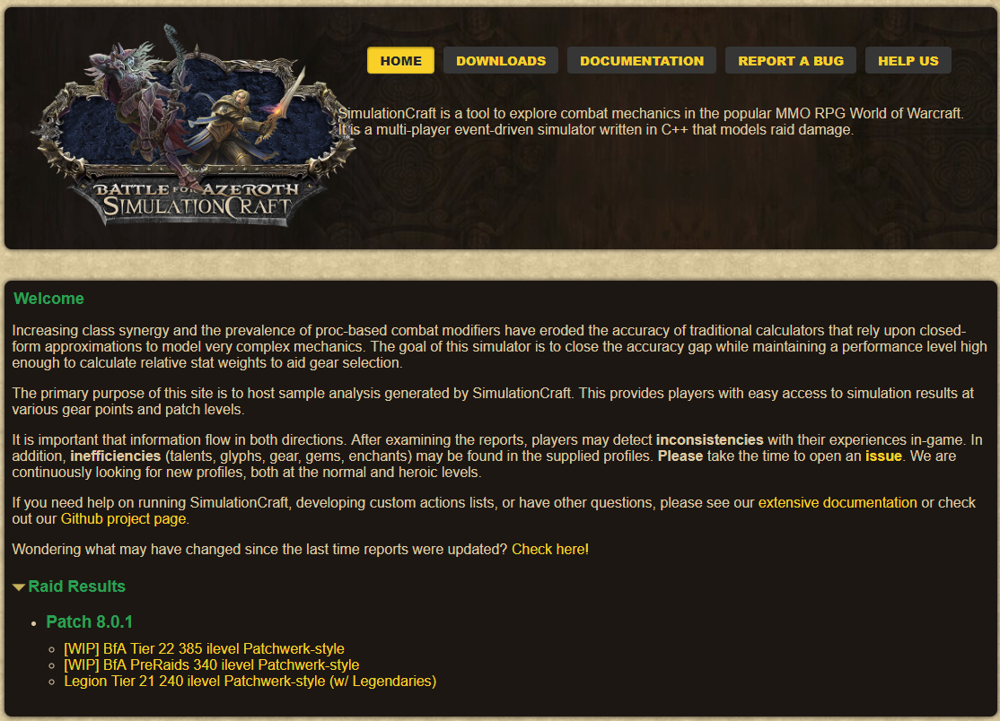

# SimulationCraft 이용하기

## SimulationCraft
http://www.simulationcraft.org/

SimulationCraft (이하 심크, simc)란 각 직업별 담당자들이 직업별 여러 특성에 맞는 딜사이클을 정의하여 해당 캐릭이 발휘할 수 있는 이론적 퍼포먼스를 측정하는 도구입니다.

하단의 Raid Results의 Patch 8.0.1은 현재 WOW 버전인 8.0.1 버전내에서 모든 직업이 최적의 조건을 갖추었을 때 뽑아낼 수 있는 이론적 DPS의 제공합니다.

현재 하단 링크를 통해 심크에서 제공하고 있는 340템렙 기준의 딜량 수치는 다음과 같습니다.

> 심크의 홈페이지의 DPS 측정 기준은 **1타겟 Patchwerk 스타일**, 즉 무빙이 거의 없는 1타겟의 말뚝딜 상황임을 가정합니다.

> 이는 해당 DPS순위는 실제 상황과 다를 수 있음을 의미하며 무빙에 의한 딜로스가 많은 직업 혹은 딜컷이나 특임 수행에 대한 내용에 따라 심크의 결과만큼의 퍼포먼스를 내지 못하는 경우가 많으므로 이를 유의하셔야 합니다.

## 내 캐릭의 심크 측정하기
심크는 WOW의 현재 버전 직업별 DPS를 제공할뿐만 아니라 특정 캐릭에 대한 연산을 수행할 수 있습니다. 심크 홈페이지의 상단 Download 메뉴를 통해 도구를 다운받아 측정할 수 있지만, 여러 메뉴들과 설정값들을 익혀야 하는 부담이 있습니다.

현재 가장 인기있는, 간단히 심크를 측정할 수 있는 RaidBots이라는 사이트를 소개합니다.

https://www.raidbots.com/

메뉴들이 직관적이며 간단하게 있는데, 자주 사용하는 메뉴에 대해 간략하게 설명드리면 다음과 같습니다.
- GEAR COMPARE: 내 장비를 다른 장비로 교체했을 때, DPS 변화를 살펴볼 수 있습니다.
- TALENT COMPARE: 특성을 변경했을 때, 각 특성별 DPS 변화를 살펴볼 수 있습니다.
- STAT WEIGHT: 내 캐릭에서 어느 스탯이 중요한지 순위를 알 수 있습니다.

## 치가특유 2차스탯중에 어떤걸 올려야되나요?
장비를 맞출 때, 어느 장비를 장착해야 하는지 궁금한 경우가 많습니다. 그런 경우 **STAT WEIGHT** 메뉴를 이용하여 어느 스탯을 위주로 장비를 장착해야 하는지 체크할 수 있습니다.

제 법사 캐릭으로 한번 측정해 보겠습니다. 먼저 STAT WEIGHT 메뉴로 들어가면 다음과 같이 간단한 입력 화면이 나타납니다.

**LOAD FROM ARMORY**에서 제 캐릭을 검색합니다. Region을 KR로, Realm을 하이잘로, Character에 제 캐릭명인 '사민'을 입력하고 잠시 기다리면 다음과 같이 현재 제 캐릭이 불러와 집니다.

내 캐릭이 정상적으로 잘 불러와졌는지 확인하고, 하단의 녹색버튼인 **GENERATE STAT WEIGHTS** 버튼을 눌러 심크를 측정합니다.

심크 측정 대기열이 다음과 같이 나타나면, 커피한잔 하며 잠깐 기다립니다.

자, 이제 심크 측정이 완료되었습니다.

제일 상단에 보이는 10,184 DPS가 5분 전투시 현재 제 캐릭으로 낼 수 있는 이론적 DPS값입니다.

그 아래 보이는 Stat Weights 박스의 내용이 현재 제 캐릭의 스탯 중요도 순서입니다.
숫자가 높을수록 중요도가 큰것을 의미하며 제 캐릭은 현재 지능이 매우 큰 격차로 1순위, 치타가 2순위이며 그 다음으로 유연과 가속이 비슷한 중요도를 가지고 있네요.
특화는 0.91이므로 특화를 줄이고 치타를 올려야겠네요.

그렇다면 저는 지능이 붙은 장비는 2차 스탯 상관없이 무조건 템렙높은 장비를 껴야하고, 지능이 없는 반지같은 것은 특화붙은것을 버리고 치타를 우선으로, 가속과 유연을 다음 순위로 껴야겠네요.

이런 방식으로 장비를 맞춰주면 되겠습니다.

## 특성을 어떤걸 찍어야 할까요?
특성중에 어느걸 찍어야 할지 고민이 되어 허수아비를 몇십분씩 쳐서 통계를 낼 수 있지만, 심크에게 간단히 일을 시켜 물어볼 수 있습니다.
이런 경우 **TALENT COMPARE** 메뉴를 이용하도록 합니다.

역시 동일하게 제 법사 캐릭으로 측정해 보겠습니다. 냉기법사는 사냉/고겨, 얼손/칠흑, 갈얼/혜폭, 동공/혹쐐의 특성 사이에서 고민하게 됩니다.

**TALENT COMPARE** 메뉴에서 동일하게 제 캐릭을 로드합니다.

입력후 조금 기다리면 캐릭이 로드되면서 하위에 특성 선택 메뉴가 추가됩니다. 여기에 변경해서 비교할 특성을 선택해 줍니다.
저는 사냉/칠흑/혜폭/혹쐐와 고겨/칠흑/갈얼/동공 2가지 특성을 비교해 보겠습니다.

입력이 완료되었으면 하단의 **COMPARE TALENTS** 녹색 버튼을 누르고 심크 측정 완료시까지 조금 기다려줍니다.

심크가 다음과 같이 2개의 특성을 비교해 주었습니다.

사냉/칠흑/혜폭/혹쐐는 10,187 DPS를 기대할 수 있는 반면, 고겨/칠흑/갈얼/동공은 9,704 DPS밖에 기대할 수 없네요.
저는 그럼 DPS가 높은 특성인 사냉/칠흑/혜폭/혹쐐를 선택하도록 하겠습니다.

위와 같은 방식으로 자신에게 도움이 되는 특성을 측정해 볼 수 있습니다.

## 심크는 5분전투 1타겟 말뚝딜만 측정?
심크의 기본 측정은 5분전투, 1타겟, 무빙없는 말뚝딜을 기준으로 측정합니다.
하지만 다른 경우를 측정하고 싶을 경우 각 화면의 중간에 보이는 Simulation Otions을 변경하여 수행할 수 있습니다.

각 영역에서 다음 옵션들을 선택할 수 있습니다.
- 전투시간
- 타겟의 갯수
- 전투의 특성

전투의 특성에 해당하는 Fight Style은 다음과 같은 의미를 가집니다.
- Patchwerk: 아무것도 없는 말뚝딜 상황
- Light Movement: 약간의 무빙
- Heavy Movement: 잦은 무빙
- Hectic Add Cleave: 잦은 무빙과 주기적인 쫄 팝업
- Helter Skelter: 미친 무빙

전투의 특성은 Patchwerk를 이용하여 자신의 캐릭이 낼 수 있는 최상의 퍼포먼스를 측정하는것이 일반적입니다.

그 외에도 모든 옵션을 보면 여러 버프 상황들과 같은 다양한 상황을 재현할 수 있습니다만 실제로는 많이 쓰이진 않습니다.

# SimulationCraft 애드온 이용하기

# Pawn 애드온 이용하기